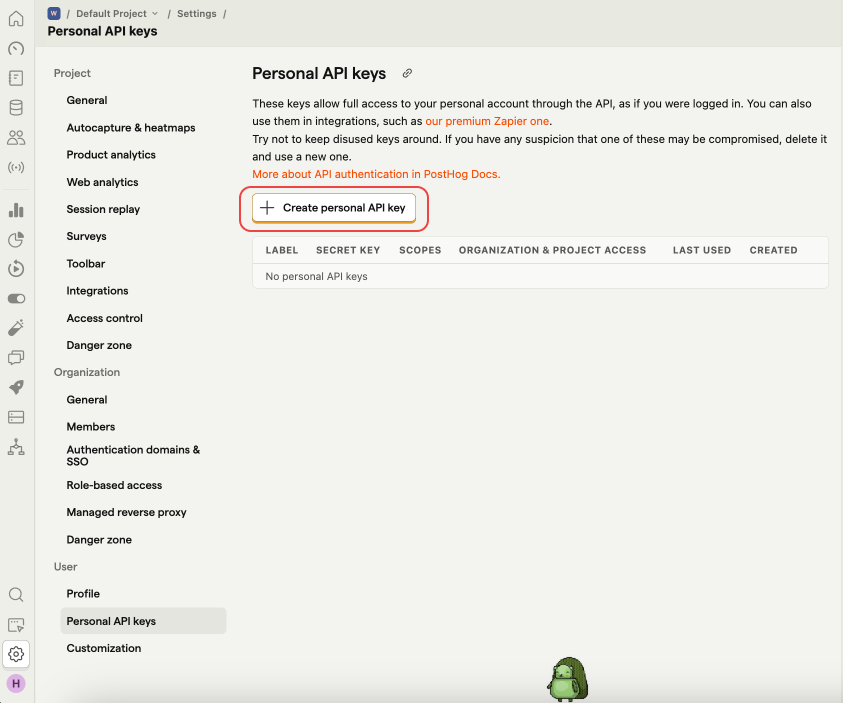
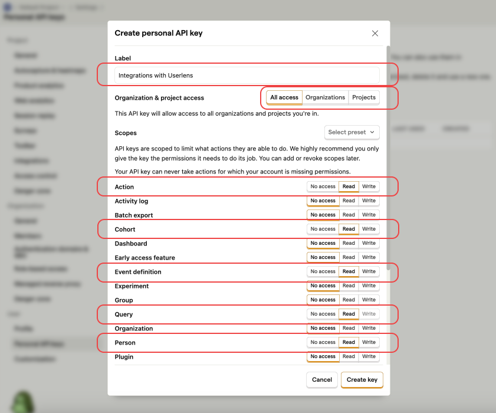
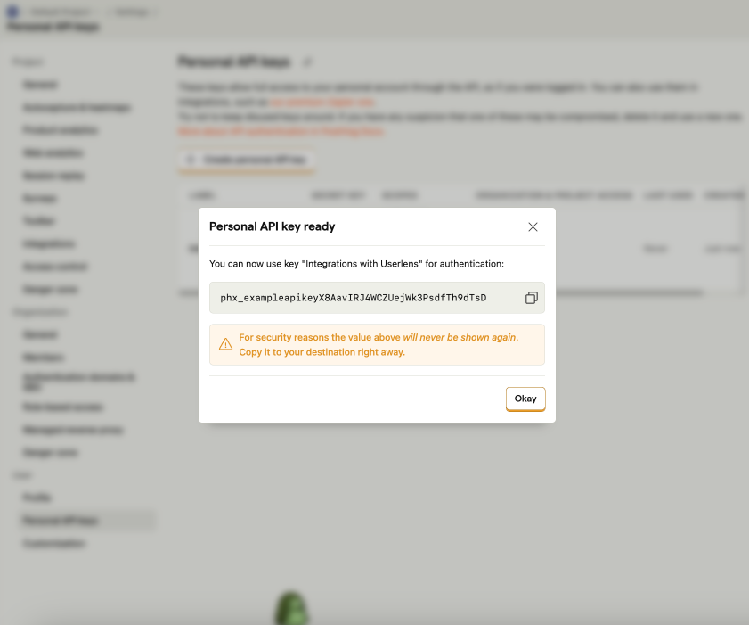

# Integrating with PostHog

This guide explains how to integrate PostHog with Userlens.

---

### 1. Access Personal API Keys in PostHog
Navigate to your [**Settings** > **Personal API Keys**](https://app.posthog.com/settings/user-api-keys) page in PostHog.

---

### 2. Create a Personal API Key
Click the **Create personal API key** button for integrations with Userlens.

---

### 3. Configure the API Key
A dialogue will appear. Follow these instructions to fill out the form and set permissions:

- **Label**: Name it "Integrations with Userlens."
- **Organization & Project Access**: Select "All access" if you are unsure which Organizations or Projects you would like to integrate with Userlens.
- **Permissions**: Grant **Read access** for the following:
  - `Action`
  - `Cohort`
  - `Event definition`
  - `Query`
  - `Person`
 
  

---

### 4. Copy Your API Key
Once created, copy your API key. You will use this key to authenticate your integration with Userlens.
Return to Userlens app.

---

That's it! You have successfully set up the API key for integrating with Userlens.
